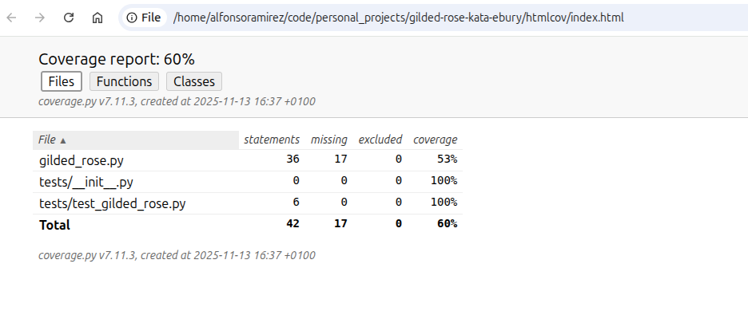
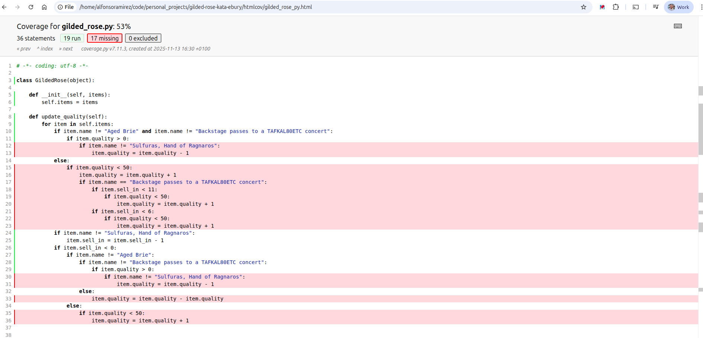

## ⚔️ Gilded Rose Kata: A Refactoring Guide

Hi and welcome to team Gilded Rose. As you know, we are a small inn with a 
prime location in a prominent city ran by a friendly innkeeper named 
Allison. We also buy and sell only the finest goods. Unfortunately, our 
goods are constantly degrading in quality as they approach their sell by 
date. We have a system in place that updates our inventory for us. It was 
developed by a no-nonsense type named Leeroy, who has moved on to new 
adventures. Your task is to add the new feature to our system so that we 
can begin selling a new category of items. First an introduction to our 
system:

- All items have a SellIn value which denotes the number of days we have 
to sell the item
- All items have a Quality value which denotes how valuable the item is
- At the end of each day our system lowers both values for every item

Pretty simple, right? Well this is where it gets interesting:

- Once the sell by date has passed, Quality degrades twice as fast
- The Quality of an item is never negative
- "Aged Brie" actually increases in Quality the older it gets
- The Quality of an item is never more than 50
- "Sulfuras", being a legendary item, never has to be sold or decreases 
in Quality
- "Backstage passes", like aged brie, increases in Quality as it's SellIn 
value approaches; Quality increases by 2 when there are 10 days or less 
and by 3 when there are 5 days or less but Quality drops to 0 after the 
concert

We have recently signed a supplier of conjured items. This requires an 
update to our system:

- "Conjured" items degrade in Quality twice as fast as normal items

Feel free to make any changes to the UpdateQuality method and add any 
new code as long as everything still works correctly. However, do not 
alter the Item class or Items property as those belong to the goblin 
in the corner who will insta-rage and one-shot you as he doesn't 
believe in shared code ownership (you can make the UpdateQuality 
method and Items property static if you like, we'll cover for you).

Just for clarification, an item can never have its Quality increase 
above 50, however "Sulfuras" is a legendary item and as such its 
Quality is 80 and it never alters.

---

## GETTING STARTED

1. Create a fork of this repository in your own GitHub account, so you can make changes with your colleagues and work over the same project
2. Clone the repository in your local machine.
3. Create a Python virtual environment
```
python3 -m venv .venv
source .venv/bin/activate
```
4. Install dependencies
```
pip install -r requirements.txt
```
5. Make sure the tests run
```
python -m pytest
```

---

### HOW TO PROCEED

The objective of this kata is to practice **refactoring legacy code**. The goal is not to rewrite the code from scratch, but to improve its design incrementally, ensuring that the existing tests do not break in the process.

The recommended natural procedure is as follows:

1.  **Establish Comprehensive Testing:** Write the necessary unit tests to cover the existing code, aiming for **100% test coverage**.
2.  **Incremental Refactoring:** Refactor the code in small, atomic steps. After each change, run the tests to ensure no existing functionality is broken.
3.  **Implement New Feature:** Once all collaborators agree that the code is sufficiently refactored, proceed to implement the new required functionality (the "Conjured" items), following the same procedure of small steps and frequent testing.
4.  **Atomic Commits:** To facilitate team collaboration and review, make atomic changes. Each commit to the repository should represent a small, coherent change that can be easily reviewed and discussed by other team members. After a commit, collaborators should pull the latest changes to ensure they are working with the most up-to-date version.
5.  **Active Collaboration:** It is crucial for all team members to participate in the discussion of proposed changes, offering ideas and suggestions to improve the code's design. Collaboration and knowledge sharing are key to the success of this exercise.
6.  **Share Results:** The final idea is to share all results at the end of the exercise so we can see how the other teams have solved the same problem.

**Note on Test Clarity and Business Logic:**

It is highly important that our tests clearly articulate **what** piece of business logic is being tested. Test names should reflect the rule they are enforcing, not just the function being called.

* **Good Example:** A test named `test_quality_of_item_is_never_more_than_50` is correct because it verifies a specific business rule (the maximum quality constraint across all items).
* **Poor Example:** A test named `test_item_quality` is unclear as it doesn't provide any information about the business logic being verified.

---

### TEST COVERAGE

A vital part of this exercise is ensuring that the existing code is completely covered by tests before beginning any refactoring. This allows us to quickly detect if any change breaks the existing functionality.

To check the test coverage, a `Makefile` has been included with a specific task for this purpose. Simply execute the following command in your terminal:

```bash
make test-coverage
```
**In case all tests do not pass, the report won't be generated.**





---

